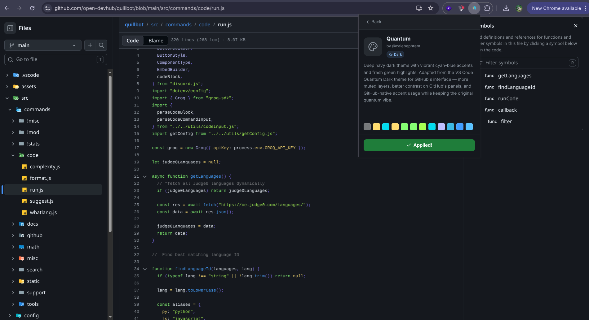
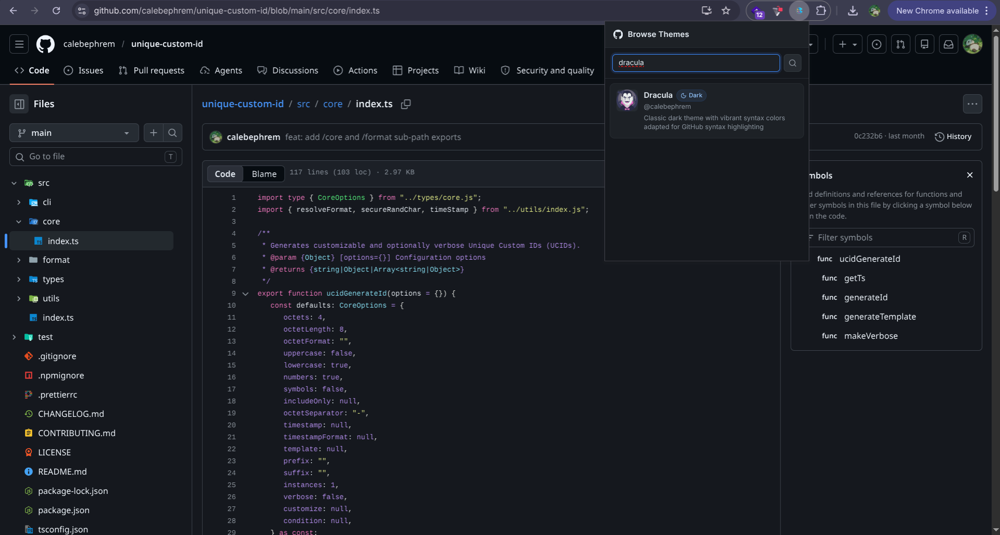
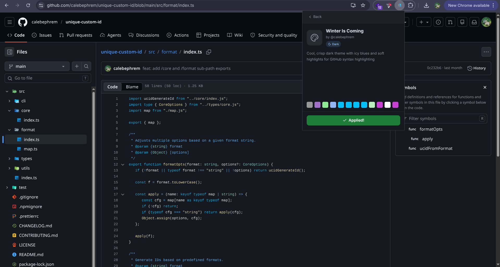

<br />
<div align="center">

  

  <p align="center" style="margin-top: 12px;">
    <strong><small>GitHub Syntax Themes</small></strong>
  </p>

</div>

# GitHub Syntax Themes

A browser extension that lets you apply custom syntax highlighting themes to GitHub code blocks, pull request diffs, and Markdown snippets.

It works by injecting CSS overrides into GitHub’s existing syntax system and mapping theme values to GitHub’s internal token classes (`.pl-*`) and modern PrettyLights CSS variables.

## What It Does

GitHub has its own built-in syntax highlighting system.

This extension overrides it by:

- Mapping theme colors to GitHub token classes (`.pl-c`, `.pl-k`, `.pl-s`, etc.)
- Injecting CSS variables for GitHub’s PrettyLights syntax system
- Applying themes across:
  - Code blocks
  - Pull request diffs
  - File views
  - Markdown snippets

In short:

You choose a theme → GitHub gets recolored

## Installation

GitHub Syntax Themes can be installed on any Chromium-based browser (Chrome, Edge, Opera, Brave, Vivaldi, Arc, etc.) and Firefox.

### 1. Download the Extension

Clone the repository and build it:

```bash
git clone https://github.com/calebephrem/github-syntax-themes.git
cd github-syntax-themes

npm install

# For chromium based browsers:
npm run build

# For firefox:
npm run build:firefox
```

After building, a production-ready extension will be generated inside the `dist/` directory.

### 2. Open Your Browser's Extension Manager

Open the extension management page for your browser:

| Browser | URL                   |
| ------- | --------------------- |
| Chrome  | `chrome://extensions` |
| Edge    | `edge://extensions`   |
| Opera   | `opera://extensions`  |
| Brave   | `brave://extensions`  |
| Vivaldi | `chrome://extensions` |
| Arc     | `chrome://extensions` |
| Firefox | `about:addons`        |

### 3. Enable Developer Mode

For Chromium-based browsers:

1. Open the Extensions page.
2. Enable **Developer Mode**.
3. New options such as **Load unpacked** will appear.

Firefox users can skip this step.

### 4. Install the Extension

#### Chromium Browsers

1. Click **Load unpacked**.
2. Go to the extension's `dist/` folder and select `chrome-mv3`.
3. The extension should appear immediately in your installed extensions list.

#### Firefox

1. Open `about:addons`.
2. Click the gear icon.
3. Select **Install Add-on From File...**
4. Go to the extension's `dist/` folder and select `firefox-mv2`.

### 5. Start Using Themes

1. Open any GitHub repository.
2. Click the GitHub Syntax Themes icon in your browser toolbar.
3. Choose a theme.
4. Voila.

Your selected theme will automatically be applied to:

- Repository files
- Pull request diffs
- Markdown code blocks
- GitHub code views

### Updating

When a new version is released:

1. Pull down the latest release.
2. Reload the extension from your browser's extension page.

Your saved theme preferences will remain intact.

### Uninstalling

You can remove the extension at any time from your browser's extension manager.

Removing the extension restores GitHub's default syntax highlighting immediately.

You can install **GitHub Syntax Themes** depending on your browser.

## Themes

Themes are **not bundled inside the extension**.

Instead, they are pulled from a separate theme repository:

👉 https://github.com/calebephrem/github-syntax-theme-store

Each theme is defined like:

```ts
syntaxHighlighting: {
  keyword: "#ff79c6",
  string: "#f1fa8c",
  comment: "#6272a4",
  functionName: "#50fa7b"
}
```

The extension automatically converts these values into GitHub-compatible styles.

## How It Works

Two styling layers are applied:

### 1. Legacy GitHub token classes

```css
.pl-k {
  color: #ff79c6 !important;
}
```

### 2. Modern PrettyLights CSS variables

```css
:root {
  --color-prettylights-syntax-keyword: #ff79c6 !important;
}
```

This ensures compatibility across both old and new GitHub UI systems.

## Features

- Fully custom GitHub syntax highlighting
- Lightweight CSS injection (no DOM rewriting)
- Instant theme switching
- Works across code, diffs, and markdown
- Multi-browser support via WXT

## Screenshots

## 

## 

## 

## Tech Stack

- WXT (browser extension framework)
- React (popup UI)
- TypeScript
- TailwindCSS
- Lucide icons

## Development

Install dependencies:

```bash
npm install
```

Run development build:

```bash
npm run dev
```

Build extension:

```bash
npm run build
```

## Contributing

We welcome contributions to both the browser extension and the theme collection.
If you’d like to add a new theme or improve an existing one, please submit it to the dedicated theme repository:

👉 https://github.com/calebephrem/github-syntax-theme-store

## License

MIT © Caleb Ephrem
